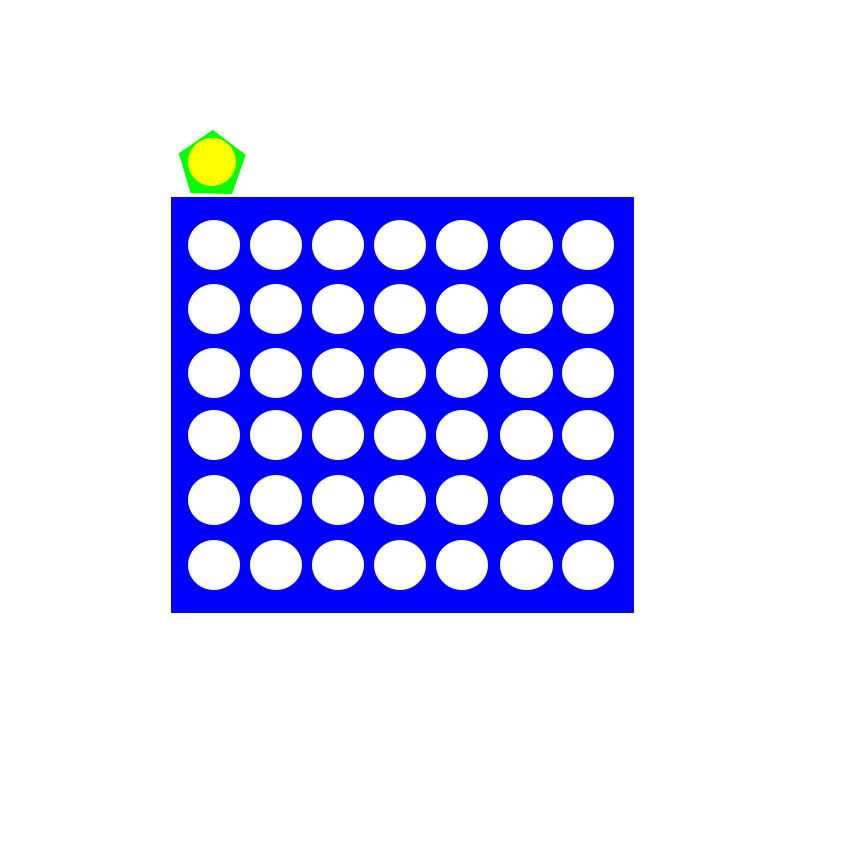
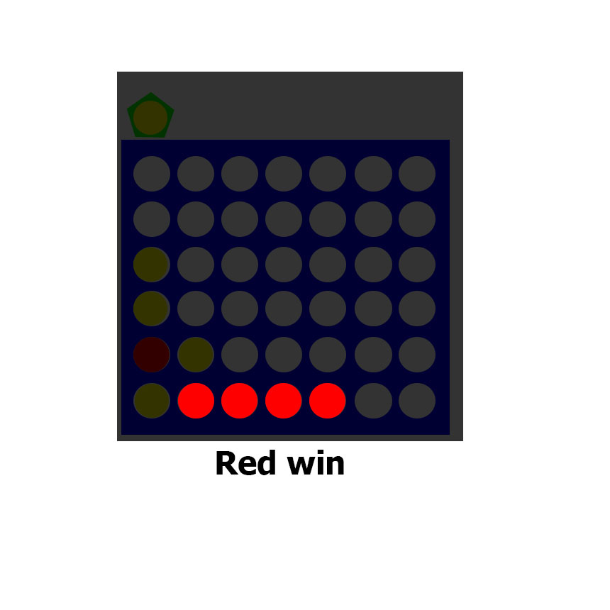

# Connect four  
_**Connect Four** (also known as Four Up, Plot Four, Find Four, Four in a Row, Four in a Line, Drop Four, and Gravitrips in the Soviet Union)_

 

## Introduction
**Connect Four** is a two-player game, in which the players choose a color and then take turns dropping colored discs into a **seven-column, six-row vertically suspended grid**.The pieces fall straight down, occupying the lowest available space within the column. Each player will drop one disc at a time this will give you a chance to either build your row or stop your opponent from getting four in row
## Objective
The objective of the game is to be the first to form a horizontal, vertical, or diagonal line of four of one's own discs.  

## Rules variations  
There are many variations of Connect Four with differing game board sizes, game pieces, and/or gameplay rules. Many variations are popular with game theory and artificial intelligence research, rather than with physical game boards and gameplay by persons.

**The most commonly used Connect Four board size is 7 columns × 6 rows.** Size variations include 5×4, 6×5, 8×7, 9×7, 10×7, 8×8.
## How the game goes on
### step 1
 * Start the game with empty grid
 
### step 2
* Before starting, players decide randomly which of them will be the beginner  
 

### step 3
* pieces slide downwards from upper holes, falling down to the last row or piling up on the last piece introduced in the same column.

### step 4
moves are made alternatively, one by turn.

### step 5
So, in every turn the introduced piece may be placed at most on seven different squares.

### step 6
The winner is the first player who gets a straight line made with four own pieces and no gaps between them.

